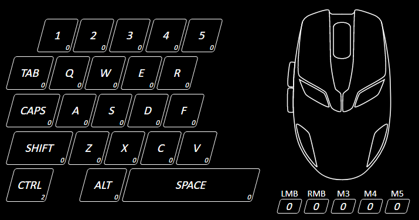

# Alhumam567 Zergatul.Obs.InputOverlay Fork
Input overlay plugin for OBS. Supported systems: Windows 10 x64. Main edits include the style of the overlay and the click counters for KBM.

# Installation
1. Download latest release here: https://github.com/Alhumam567/Zergatul.Obs.InputOverlay/releases/tag/Latest
2. Unzip it to any location you want

# Usage
1. Run `Zergatul.Obs.InputOverlay.exe`, and keep it open while you want to use input overlay in OBS
2. In OBS, add Source 🡒 Browser.
    - `URL`: `http://localhost:5001/default-keyboard.html`
    - `Width`: `450`, `Height`: `320`
    - Check `Use custom framerate`, and set FPS to `30`. You can set it to `60`, but please check [Performance issues](docs/PerformanceIssues.md) page first.
    - Check `Shutdown source when not visible`. This will allow you to hide/show source after you restarted the server
    - Do the same for mouse: `URL`: `http://localhost:5001/default-mouse.html`, `Width`: `250`, `Height`: `400`

# Advanced usage
1. If you are running server application without elevated priviledges, it will not be able to detect your inputs from applications running under administrator. Example: I have game started from Steam, and command prompt, running as Administrator. Server will be able to detect inputs in game, but will show nothing when I type something in command prompt.
2. You can show more keys, change style, colors, animations if you are familiar with HTML and CSS. Check `wwwroot` folder within application folder. It contains HTML, CSS and JavaScript files. You can get all supported key names from [KeyboardButton.cs](src/Keyboard/KeyboardButton.cs) file.
3. If you want to play on one PC, and run OBS on another you need to run executable with parameter: `--urls http://<IP address>:<port>/`. IP address should be local network address of PC where you play game and run executable. You can choose port whatever you like, but it is better not use ports lower than 1000. If you have firewall make sure you opened incoming TCP port. Example: `Zergatul.Obs.InputOverlay.exe --urls http://192.168.1.123:12345/`. If everything is fine, you should see in the log: `Now listening on: http://192.168.1.123:12345`. If you create `.bat` or link file for this, make sure you don't mess up with current directory. Check `Content root path` log record. It should point to the same directory as executable. This is where application looks for `wwwroot` directory.

# Troubleshooting
If you encounter any problems with running Browser Source in OBS, you can open keyboard/mouse URL's in your browser and check for errors in developer console. In `<style>` element uncomment line: `background-color: black;`. Now open URL in your browser with Developer Tools opened (usually this is `F12` key). Don't forget to comment out this line again if you start using overlay in OBS. Sometimes browser source in OBS caches styles, you can use `Refresh cache of current page` button.

# Build application from sources
You can open solution file in Visual Studio 2022. Program is written in C#, by using ASP.NET Core for web server. Use `Build` -> `Publish` menu option to create self-contained package.
You can also build it by using [.NET CLI](https://docs.microsoft.com/en-us/dotnet/core/tools/). Download .NET 6.0 SDK, go to `src` directory and run from command prompt: `dotnet publish -c Release -p:PublishProfile=FolderProfile`
